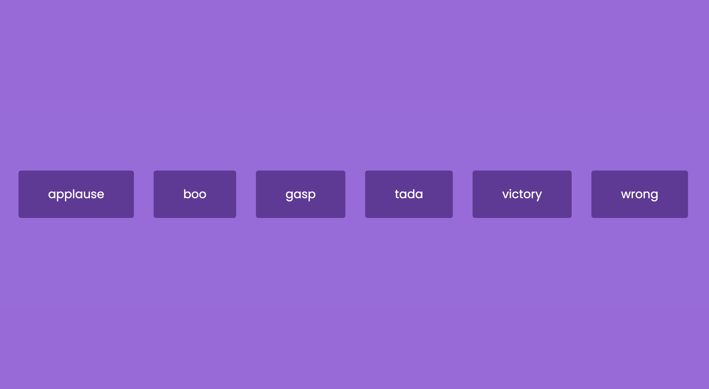

# 50 Projects in 50 Days - Sound Board

This is a code along project in the [50 Projects In 50 Days - HTML, CSS & JavaScript Udemy Course](https://www.udemy.com/course/50-projects-50-days/). Sharpen your skills by building 50 quick, unique & fun mini projects.

## Table of contents 😌

- [Overview](#overview)
  - [The project](#the-project)
  - [Screenshot](#screenshot)
  - [Links](#links)
- [My process](#my-process)
  - [Built with](#built-with)
  - [What I learned](#what-i-learned)
  - [Continued development](#continued-development)
  - [Code snippets](#im-really-proud-of-these-code-snippets%EF%B8%8F)
  - [Useful resources](#useful-resources)
- [Author](#author)
- [Acknowledgments](#acknowledgments)

## Overview👋🏾

Welcome to the 9<sup>th</sup> mini-project of the course!

### The project😥

In this project users will be able to:

- Build a site that plays various sounds.

### Screenshot🌇



### Links👩🏾‍💻

- Solution URL: (https://github.com/MaianneThornton/50in50_SoundBoard)
- Live Site URL: (https://marvelous-sundae-462332.netlify.app)

## My process💭

This is a simple project that I started by marking out initial id's in the html file. Next I began building the buttons by way of JavaScript. I then styled the site, and buttons. Lastly I added functionality by way of JavaScript to play the desired sound with the click of a button.

### Built with👷🏾‍♀️

- Semantic HTML5 markup
- CSS custom properties
- Flexbox
- JavaScript

### What I learned👩🏾‍🏫

I learned that HTML5 comes with access to a Web Audio API that complements the audio media element. By accessing the elements of the API I can easily manipulate the sounds.

I learned the logic behind accessing the Web Audio API to add play and pause functionality.

### Continued development🔮

In the future I plan on continuing to practice positioning elements using flexbox, and using different selectors such as nth of type to select elements.

I also plan on continuing to practice using event listeners to make my pages more functional.

I plan on continuing my studies on the Web Audio API and strengthening my skills in utilizing the API's elements.

### I'm really proud of these code snippets✂️

```js
sounds.forEach((sound) => {
  const btn = document.createElement('button');
  btn.classList.add('btn');

  btn.innerText = sound;

  btn.addEventListener('click', () => {
    stopSongs();
    document.getElementById(sound).play();
  });

  document.getElementById('buttons').appendChild(btn);
});

function stopSongs() {
  sounds.forEach((sound) => {
    const song = document.getElementById(sound);

    song.pause();

    song.currentTime = 0;
  });
}
```

### Useful resources📖

- [Resource 1](https://developer.mozilla.org/en-US/docs/Web/HTML/Element/audio) - This article which helped me to understand the embed audio element.
- [Resource 2](https://developer.mozilla.org/en-US/docs/Web/API/Web_Audio_API/Using_Web_Audio_API) - This is an amazing article which helped me to dive deeper into the Web Audio API element's and how to access and utilize each one.

## Author🔎

- Website - [Portfolio Site](https://www.maiannethornton.com/Portfolio/index.html)
- Frontend Mentor - [@MaianneThornton](https://www.frontendmentor.io/profile/MaianneThornton)
- GitHub - [@MaianneThornton](GitHub.com/MaianneThornton)
- Twitter - [@MaianneThornton](https://twitter.com/MaianneThornton)
- LinkedIn - [@MaianneThornton](https://www.linkedin.com/in/maiannethornton/)

## Acknowledgments🙏🏾

Special Thanks go to [Brad Traversy](http://www.traversymedia.com/) and [Florin Pop](http://www.florin-pop.com/) creating the course and making reviewing concepts fun 😊.
